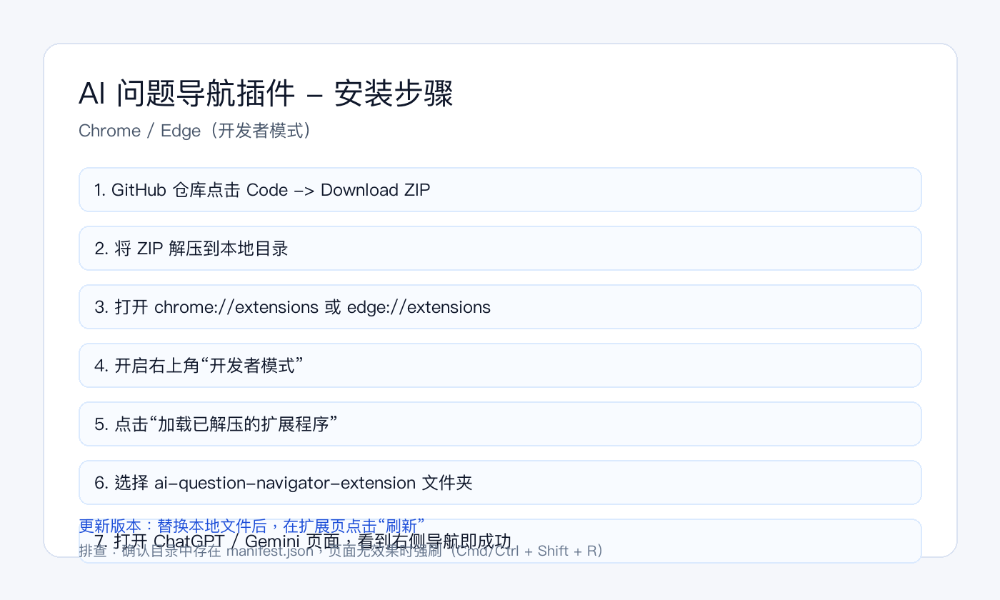

# AI 问题导航插件（ChatGPT + Gemini）

一个聚焦「只导航用户提问」的浏览器插件，解决多轮对话里回看历史问题需要反复上滑的问题。

## 支持平台

- ChatGPT（`chatgpt.com` / `chat.openai.com`）
- Gemini（`gemini.google.com`）

## 功能

- 自动识别当前平台
- 抓取并结构化用户提问（仅用户消息）
- 右侧悬浮导航栏（`Q1`、`Q2`...）
- 点击问题平滑定位到对应消息

## 安装

### 方式一：从 GitHub 安装（推荐）

1. 打开本仓库页面，点击 `Code` -> `Download ZIP`
2. 将 ZIP 解压到本地任意目录
3. Chrome 打开 `chrome://extensions`（Edge 打开 `edge://extensions`）
4. 打开右上角「开发者模式」
5. 点击「加载已解压的扩展程序」
6. 选择解压后的 `ai-question-navigator-extension` 文件夹

### 使用与更新

- 安装后，进入 ChatGPT 或 Gemini 网页即可看到右侧导航按钮
- 升级版本时，替换本地文件后在扩展管理页点击「刷新」即可生效

### 常见问题

- 看不到扩展：确认已开启开发者模式，并选择的是解压后的根目录（包含 `manifest.json`）
- 页面无导航：刷新网页（`Cmd/Ctrl + Shift + R`）后重试

## 说明

- 当前版本维护 ChatGPT、Gemini 两个平台适配。
- Gemini 已启用文本去重，避免同一问题在导航中重复出现。

## 开源与协作

- 许可证：MIT（见 `LICENSE`）
- 欢迎提交 issue / PR 修复选择器和兼容性问题
